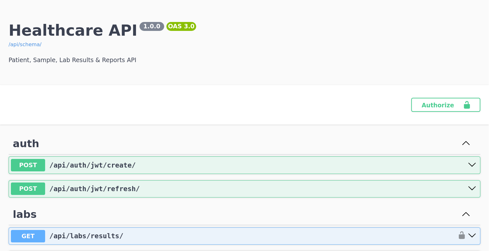
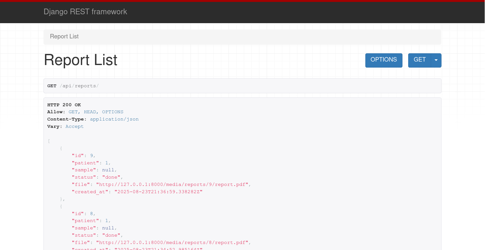

# 🏥 Healthcare API (Django + DRF + JWT + Celery)

A secure REST API to manage **Patients**, **Samples**, and **Lab Results**, with background tasks for generating **dark-themed clinical PDF reports** — built for portfolio and real-world healthcare workflows.

---

## 🚀 Tech Stack
- **Backend:** Django + Django REST Framework  
- **Auth:** JWT (SimpleJWT)  
- **Async:** Celery + Redis  
- **Database:** PostgreSQL (SQLite for dev)  
- **PDF Reports:** ReportLab + Matplotlib (dark charts)  
- **Docs:** OpenAPI/Swagger (drf-spectacular)  
- **Deploy:** Docker (optional)  

---

## ✨ Features
✅ JWT authentication (access/refresh)  
✅ CRUD for Patients, Samples, Results  
✅ Filtering & pagination  
✅ Background PDF generation with Celery  
✅ Dark, single-page PDF layout (metrics + bar + pie charts)  
✅ Demo data seeding with Faker  

---

## 🖥️ Quickstart (Local)

```bash
# 1) Create & activate venv
python -m venv .venv
source .venv/bin/activate  # Windows: .venv\Scripts\activate

# 2) Install dependencies
pip install -r requirements.txt
# recommend: reportlab>=4.0 (avoid md5 usedforsecurity issue)

# 3) Run migrations
python manage.py migrate

# 4) Create superuser
python manage.py createsuperuser

# 5) Start Redis (local or Docker)
redis-server
# or
docker run -p 6379:6379 redis:7

# 6) Celery worker (terminal 1)
celery -A config worker -l info

# 7) Run API (terminal 2)
python manage.py runserver
```

Then open:  
- API root → [http://127.0.0.1:8000/api/](http://127.0.0.1:8000/api/)  
- Swagger → [http://127.0.0.1:8000/api/schema/swagger-ui/](http://127.0.0.1:8000/api/schema/swagger-ui/)  

---

## 📸 Screenshots

### 🔑 Swagger UI


### 📊 Report generation


---

## ⚙️ Settings & Notes
- Use **ReportLab ≥ 4.0** (avoids `usedforsecurity` bug).  
- For production: PostgreSQL + S3 (media) + Redis.  
- Always set `DEBUG=False` and configure `ALLOWED_HOSTS`.  

---

## 📄 License
MIT  

---

## 👤 Author
Built with ❤️ by **Gabriel Rosa Arcangelo** (@Gabriel-Rosa-Arcangelo)  
Need healthcare automation or custom systems? Let’s connect on LinkedIn! 
